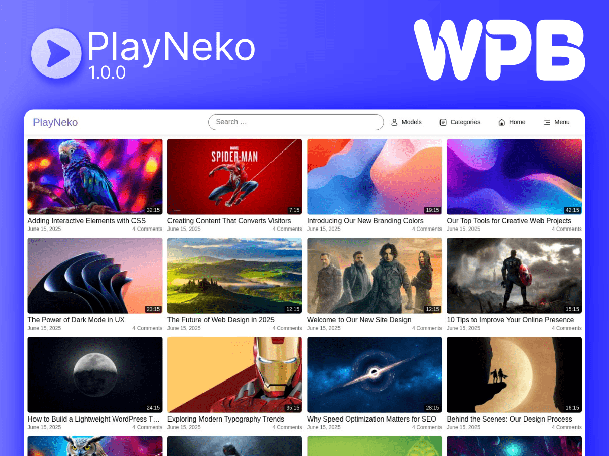

# PlayNeko WordPress Theme

PlayNeko is a modern, feature-rich WordPress theme designed specifically for video content creators and publishers. With its sleek design, responsive layout, and powerful video features, PlayNeko provides an exceptional viewing experience for your audience.

## ✨ Features

### 🎥 Video-First Design
- Custom video player integration with ArtPlayer.js
- Responsive video container with adaptive sizing
- Video duration display and metadata support
- Thumbnail preview system

### 📱 Mobile-Optimized
- Modern two-part header design
- Responsive navigation with dropdown support
- Touch-friendly mobile menu
- Optimized mobile search experience

### 🎨 Customization
- Four beautiful color schemes:
  - Default Blue
  - Royal Purple
  - Forest Green
  - Ruby Red
- Customizable through WordPress Customizer
- Easy-to-use color controls
- Custom header and footer options

### 💡 Smart Features
- Advanced search functionality
- Like/Share system for videos
- Leaderboard banner (728x90) support
- Category and tag organization
- Model taxonomy support
- Related videos suggestions
- Sticky sidebar support

### 🚀 Performance
- Optimized for speed and performance
- Mobile-first approach
- Clean, semantic HTML5
- Modern CSS with custom properties

## 📦 Installation

1. Download the theme from GitHub
2. Go to your WordPress admin panel
3. Navigate to Appearance → Themes
4. Click "Add New"
5. Click "Upload Theme"
6. Choose the downloaded zip file
7. Click "Install Now"
8. Activate the theme

## 🛠️ Requirements

- WordPress 6.0 or higher
- PHP 7.4 or higher
- Modern web browsers (Chrome, Firefox, Safari, Edge)

## 📝 Documentation

### Theme Options
The theme options can be accessed through WordPress Customizer (Appearance → Customize):

1. **Colors**
   - Primary Color
   - Secondary Color
   - Background Color
   - Text Color

2. **Header Settings**
   - Logo Upload
   - Header Layout
   - Banner Settings

3. **Footer Settings**
   - Footer Text
   - Social Links

### Video Post Setup
1. Create a new post
2. Add video URL in the custom field
3. Set featured image as video thumbnail
4. Add video duration in the custom field
5. Categorize and tag your video
6. Assign models if applicable

## 🤝 Contributing

We welcome contributions to PlayNeko! If you have suggestions or find bugs:

1. Fork the repository
2. Create a feature branch
3. Commit your changes
4. Push to the branch
5. Open a Pull Request

## 📄 License

PlayNeko is licensed under the GPL v2 or later.

## 👨‍💻 Credits

PlayNeko is developed and maintained by [WPPoy](https://wpboy.net).

### Special Thanks
- ArtPlayer.js for video player functionality
- WordPress community for inspiration and support

---

Made with ❤️ by [WPPoy](https://wpboy.net)
